<p align="center">
  
</p>

<h1 align="center">MCP Gate</h1>

<p align="center">
  <strong>Secure gateway between AI agents (Claude, ChatGPT, Cursor…) and your SSH infrastructure</strong>
</p>

<p align="center">
  <a href="LICENSE"></a>
  
  
  
</p>

<p align="center">
  <a href="#quick-start">Quick Start</a> ·
  <a href="#features">Features</a> ·
  <a href="#screenshots">Screenshots</a> ·
  <a href="docs/guide.md">Full Guide</a> ·
  <a href="CHANGELOG.md">Changelog</a>
</p>

---

## What is MCP Gate?

MCP Gate is a self-hosted security gateway that lets AI assistants (LLMs) execute **only pre-approved commands** on your servers via SSH. Every command is checked against a whitelist, every action is logged, and you stay in full control.

Think of it as a **firewall for AI → SSH access**: your LLM agent connects via the standard [MCP protocol](https://modelcontextprotocol.io/), MCP Gate checks the command against the whitelist, optionally waits for your approval, executes it on the target host via SSH, and returns the result — all with full audit trail.

```
LLM Agent ──MCP Protocol──▶ MCP Gate ──SSH──▶ Your Servers
                               │
                       ┌───────┴───────┐
                       │  ✓ Whitelist  │
                       │  🔐 Secrets   │
                       │  ⏳ Approval  │
                       │  📋 Audit     │
                       └───────────────┘
```

### Why MCP Gate?

- **Whitelist-only** — commands not in the whitelist are blocked before reaching SSH. Deny sets always win.
- **Human-in-the-loop** — four approval modes (auto / pessimistic / optimistic / strict) let you decide what runs without your approval and what needs a manual confirm.
- **Full audit trail** — every request, block, CRUD operation, and approval decision is logged with context. Export as JSON/CSV, view in real-time via WebSocket.

---

## Features

| Category | Features |
|----------|----------|
| **Security** | Whitelist-only execution · Dual-layer filtering `(host_allow ∩ agent_allow) - (host_deny ∪ agent_deny)` · Fernet-encrypted secrets vault · `$SECRET{id}` substitution with output scrubbing · Parameterized commands with regex validation · Managed known_hosts (TOFU + MITM protection) · Rate limiting |
| **Approval** | Four modes: `auto`, `pessimistic`, `optimistic`, `strict` · Real-time WebSocket notifications · Browser push notifications · Telegram and SMTP alerts |
| **MCP Protocol** | Streamable HTTP + SSE transport · OAuth 2.0 with DCR and PKCE S256 · Per-agent Bearer tokens (90-day) · Claude.ai, Cursor, Windsurf, Continue, Cline connect natively |
| **Authentication** | Three modes: `basic` (bcrypt + signed cookie), `proxy` (Authentik/Keycloak/Authelia), `none` (homelab behind VPN) |
| **Agents** | Support for Claude, ChatGPT, Gemini, Cursor, Windsurf, Continue, Cline, Open WebUI, Custom · Per-agent command sets, rate limits, allowed hosts · Enable/disable toggle with instant MCP access revocation |
| **Management** | Command Sets (Allow/Deny) · Host Setup Instructions (auto-generated bash scripts) · Import/Export (JSON paste or file upload) · SSH key lifecycle management · Dashboard with live metrics |
| **UI** | Dark glassmorphism theme · 6 built-in color schemes · Custom backgrounds · i18n (English + Russian) · Responsive layout |

---

## Screenshots

<table>
<tr>
<td align="center"><strong>Login</strong><br>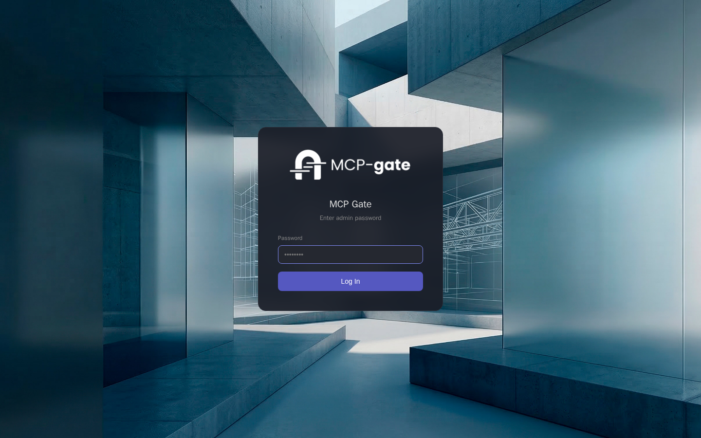</td>
<td align="center"><strong>Dashboard</strong><br>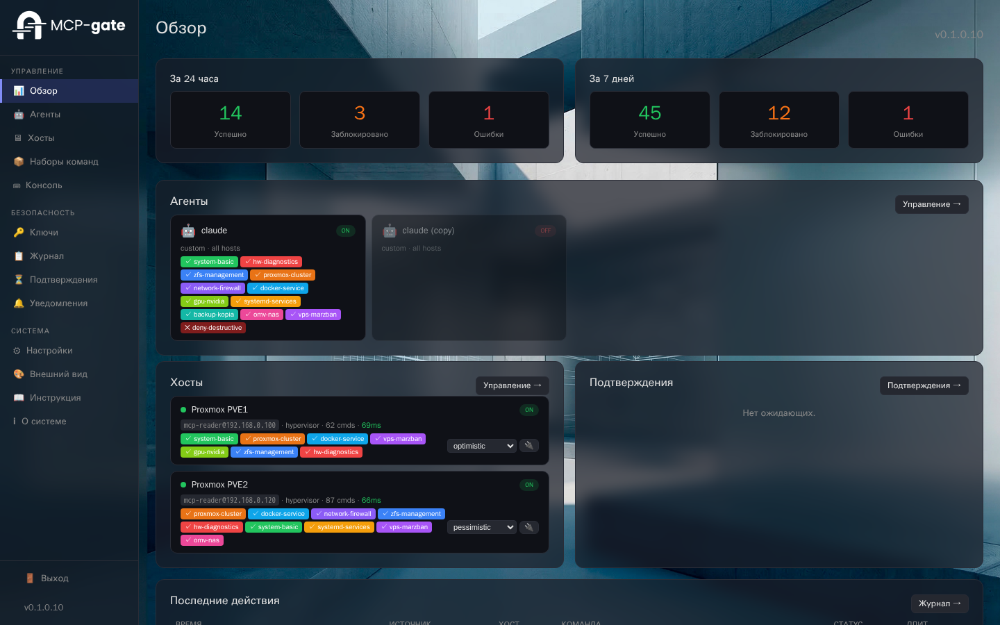</td>
</tr>
<tr>
<td align="center"><strong>Hosts</strong><br>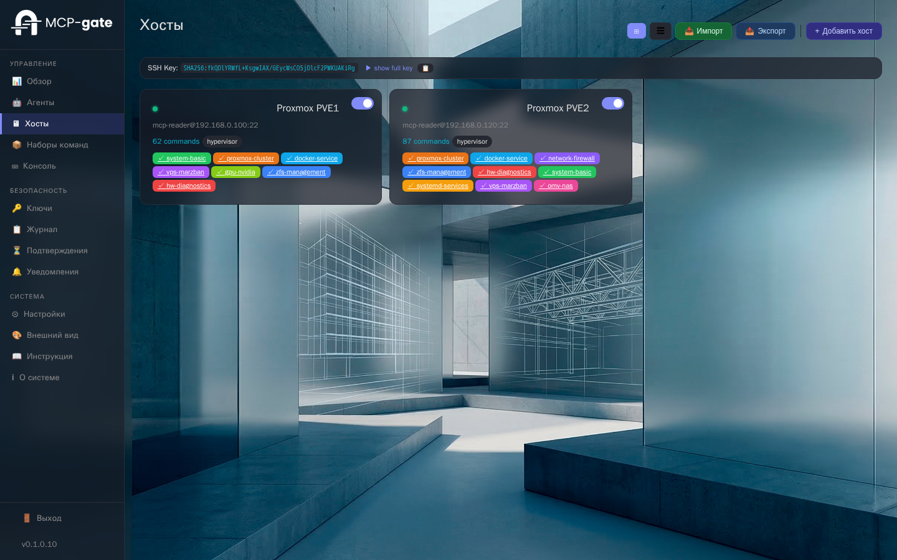</td>
<td align="center"><strong>Agents</strong><br>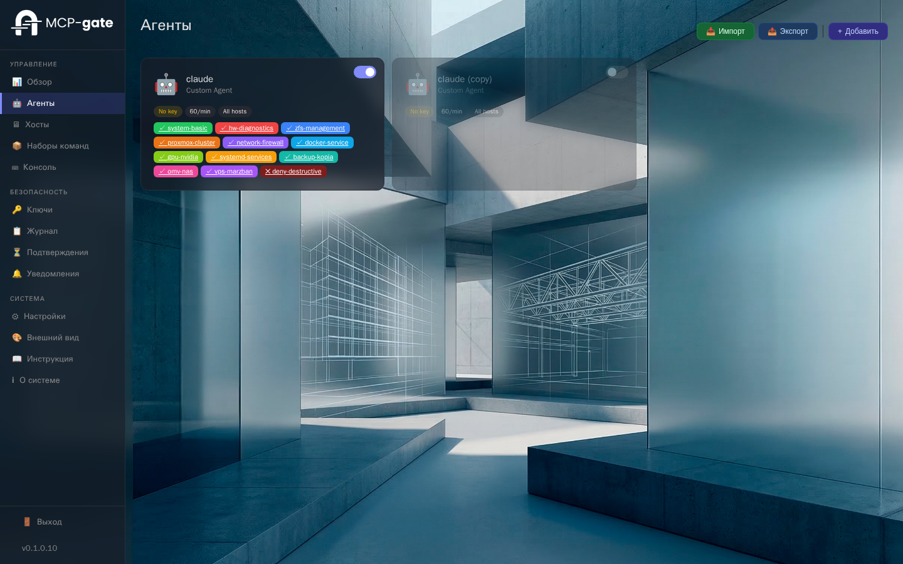</td>
</tr>
<tr>
<td align="center"><strong>Command Sets</strong><br>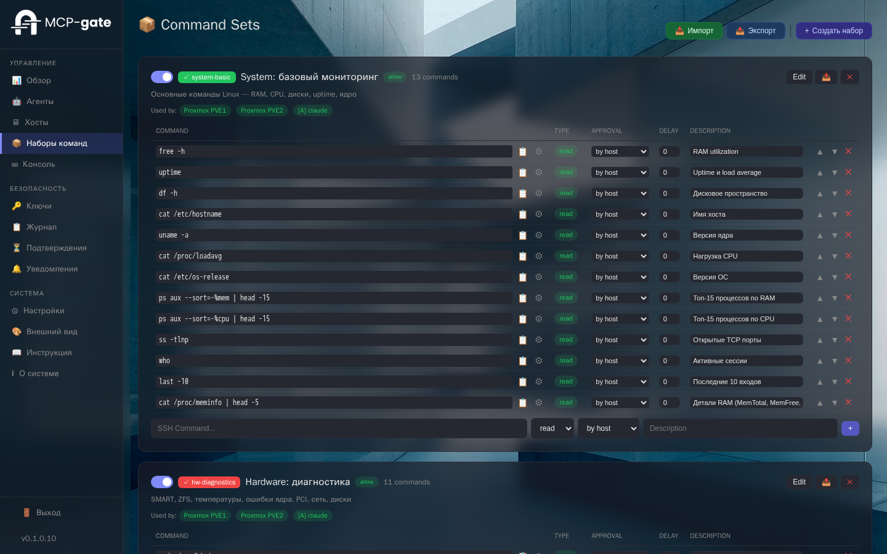</td>
<td align="center"><strong>Console</strong><br>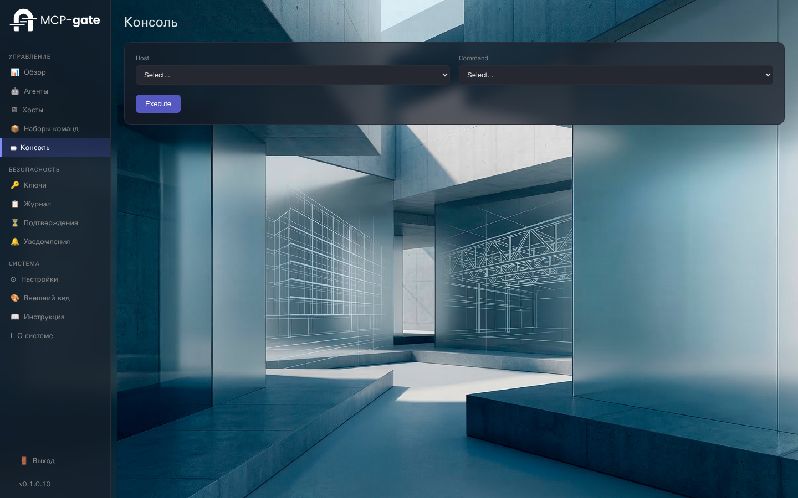</td>
</tr>
<tr>
<td align="center"><strong>Audit Log</strong><br>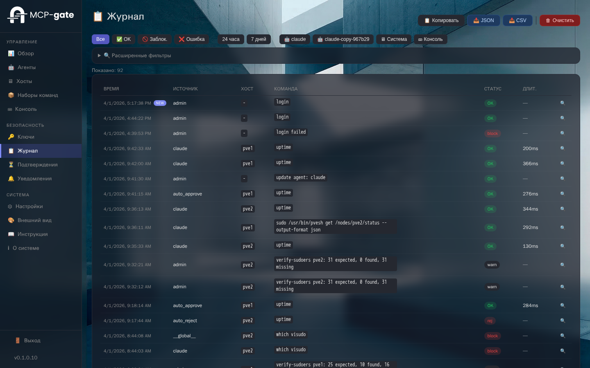</td>
<td align="center"><strong>Approvals</strong><br>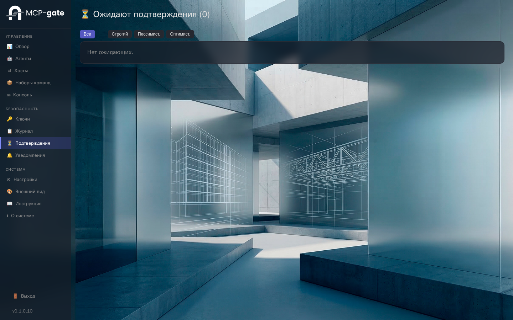</td>
</tr>
<tr>
<td align="center"><strong>Secrets Vault</strong><br>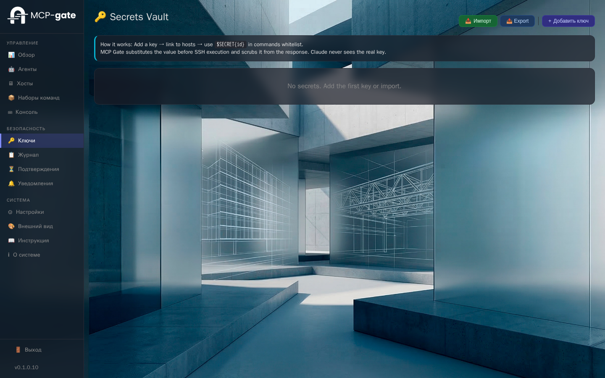</td>
<td align="center"><strong>Notifications</strong><br>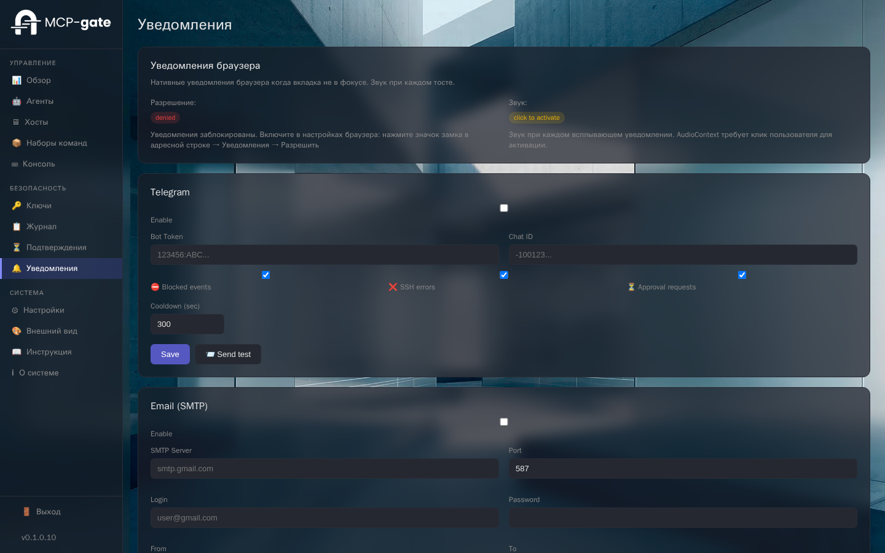</td>
</tr>
<tr>
<td align="center"><strong>Settings</strong><br>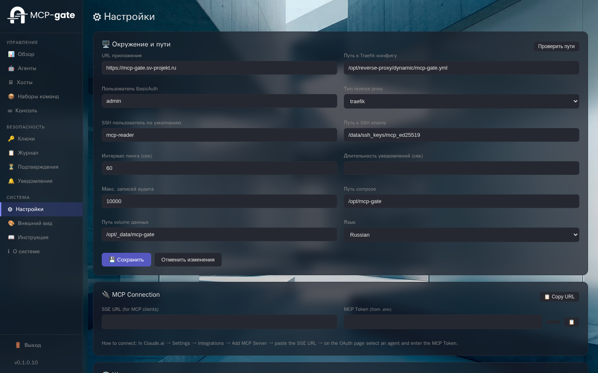</td>
<td align="center"><strong>Appearance</strong><br>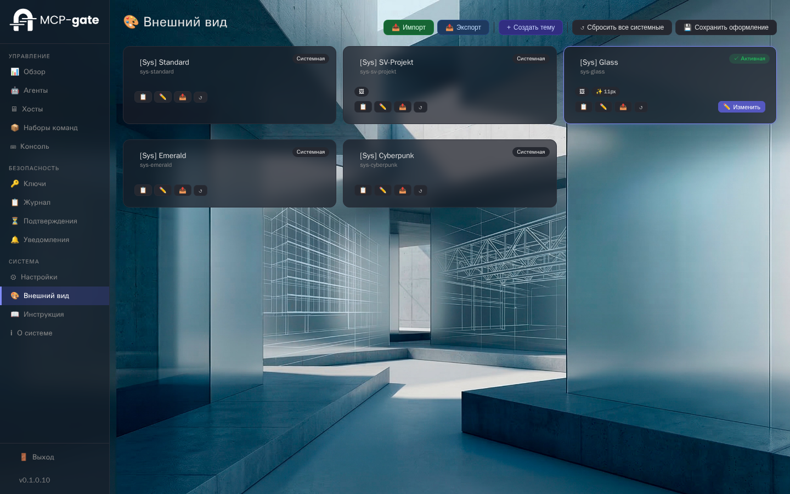</td>
</tr>
</table>

---

## Quick Start

### Prerequisites

- Docker Engine 24+ with Compose V2 (`docker compose`)
- SSH access to target servers
- (Optional) Reverse proxy with HTTPS for remote MCP clients (Claude.ai, etc.)

### 1. Clone and configure

```bash
git clone https://github.com/sv102/mcp-gate.git
cd mcp-gate
cp .env.example .env
```

Edit `.env`:

```bash
# Required — authentication token for MCP clients
MCP_TOKEN=$(openssl rand -hex 32)

# Required if connecting Claude.ai or other external MCP clients
MCP_BASE_URL=https://mcp-gate.example.com

# Data directory (default: /data inside container)
DATA_DIR=/data
```

### 2. Start

```bash
docker compose up -d
```

Or use the pre-built image:

```bash
# In compose.yaml, replace `build:` with:
#   image: ghcr.io/sv102/mcp-gate:latest
docker compose up -d
```

### 3. First-time setup

Open `http://your-server:8090` in your browser.

1. **Set admin password** — creates your login credentials (bcrypt-hashed, stored locally in `data/config.yaml`)
2. **Bootstrap wizard** — generates an Ed25519 SSH key pair and an agent API key. **Save the API key — it is shown only once.**

### 4. Add a host

Go to **Hosts → Add Host**:

1. Enter hostname/IP, SSH port, and the SSH user (default: `mcp-reader`)
2. Assign command sets (Allow and/or Deny)
3. Choose an approval mode (`auto`, `pessimistic`, `optimistic`, `strict`)
4. Save

### 5. Prepare the target host

Each host card includes a **Host Setup Instructions** section with ready-to-run commands:

1. Open the host details → expand "Host Setup Instructions"
2. Click **Download .sh** to get a setup script
3. Run the script as root on the target server:

```bash
# On the target host:
sudo bash setup-my-host.sh
```

This creates the SSH user, installs the public key, and configures sudoers with exact-match rules for each whitelisted sudo command.

Alternatively, use the **Deploy Key** button in the host details to deploy the key over SSH automatically (requires initial password/key access).

### 6. Connect your AI agent

#### Claude.ai / Cursor / Windsurf / Continue / Cline (MCP protocol)

In your MCP client settings, add a new MCP server:

```
URL: https://your-server/sse
```

The OAuth 2.0 authorization flow will guide you through selecting an agent and entering the MCP token.

#### API (custom agents)

```bash
curl -X POST https://your-server/api/exec \
  -H "X-API-Key: YOUR_API_KEY" \
  -H "Content-Type: application/json" \
  -d '{"host_id": "my-server", "command": "uptime"}'
```

Response:
```json
{"status": "ok", "output": " 14:32:01 up 42 days...", "exit_code": 0, "duration_ms": 230}
```

---

## Architecture

```
┌──────────────────────────────────────────────┐
│              MCP Gate Container              │
│                                              │
│  FastAPI (Python 3.12) + Uvicorn             │
│                                              │
│  ┌─────────────┐    ┌───────────────────┐    │
│  │ MCP Protocol│    │    Admin WebUI    │    │
│  │ OAuth 2.0   │    │  Alpine.js+Jinja2 │    │
│  │ SSE + HTTP  │    │  Dashboard/Audit  │    │
│  └──────┬──────┘    └────────┬──────────┘    │
│         │                    │               │
│  ┌──────▼────────────────────▼──────────┐    │
│  │        Unified Exec Pipeline         │    │
│  │  Auth → Whitelist → Params → Approve │    │
│  │  → Secrets → SSH → Scrub → Audit     │    │
│  └──────────────────┬──────────────────-┘    │
│                     │                        │
│  ┌──────────────────▼──────────────────┐     │
│  │       Paramiko SSH Client           │     │
│  │  Ed25519 keys · Managed known_hosts │     │
│  └─────────────────────────────────────┘     │
└──────────────────────────────────────────────┘
         │              │              │
    SSH to Host A   SSH to Host B   SSH to Host C
```

### Data Files

All data is stored in human-readable YAML/JSON files:

| File | Purpose |
|------|---------|
| `data/config.yaml` | Instance configuration, auth settings, appearance |
| `data/hosts.yaml` | SSH host definitions and their command sets |
| `data/agents.yaml` | Agent definitions, permissions, and API keys |
| `data/command_sets.yaml` | Reusable command groups (Allow/Deny) |
| `data/secrets.yaml` | Fernet-encrypted secrets for `$SECRET{id}` |
| `data/audit.jsonl` | Append-only audit log |
| `data/ssh_keys/` | Ed25519 key pair, known_hosts, Fernet key |

---

## Configuration

### Environment Variables

| Variable | Required | Default | Description |
|----------|----------|---------|-------------|
| `MCP_TOKEN` | Yes | — | Token for MCP client authentication (OAuth approval page) |
| `MCP_BASE_URL` | Yes* | — | Public URL for OAuth/MCP (*required for external MCP clients) |
| `DATA_DIR` | No | `/data` | Path to persistent data directory |

### Authentication Modes

| Mode | Use case | How it works |
|------|----------|--------------|
| `basic` | Default | Built-in login page, bcrypt password, HMAC-signed httpOnly cookie (7 days) |
| `proxy` | Enterprise SSO | Trusts `X-Forwarded-User` / `X-Forwarded-Email` from reverse proxy (Authentik, Keycloak, Authelia) |
| `none` | Homelab behind VPN | No auth — the network is the trust boundary |

MCP transport and agent API use their own authentication (OAuth 2.0 / API keys) independently of the UI auth mode.

### Approval Modes

| Mode | Behavior | Timeout action |
|------|----------|----------------|
| `auto` | Execute immediately, no approval needed | — |
| `pessimistic` | Queue for approval, wait for human decision | Auto-**reject** |
| `optimistic` | Queue for approval, wait for human decision | Auto-**approve** |
| `strict` | Queue forever, no timeout | Never auto-resolves |

Set per-host in host settings. Can also be overridden per-command in command set definitions.

### Command Sets

Two types with a clear priority rule:

- **Allow** (✓) — whitelist of permitted commands
- **Deny** (✕) — blacklist, **always wins** over allow

Authorization formula: `(host_allow ∩ agent_allow) - (host_deny ∪ agent_deny)`

### Reverse Proxy

MCP Gate works behind any reverse proxy. Example for **Traefik**:

```yaml
http:
  routers:
    mcp-gate:
      rule: "Host(`mcp-gate.example.com`)"
      service: mcp-gate
      tls:
        certResolver: le
  services:
    mcp-gate:
      loadBalancer:
        servers:
          - url: "http://mcp-gate:8000"
```

For **Nginx**:

```nginx
server {
    listen 443 ssl;
    server_name mcp-gate.example.com;

    location / {
        proxy_pass http://localhost:8090;
        proxy_http_version 1.1;
        proxy_set_header Upgrade $http_upgrade;
        proxy_set_header Connection "upgrade";
        proxy_set_header Host $host;
        proxy_set_header X-Real-IP $remote_addr;
        proxy_set_header X-Forwarded-For $proxy_add_x_forwarded_for;
        proxy_set_header X-Forwarded-Proto $scheme;
        proxy_read_timeout 300s;
    }
}
```

### Custom Docker Network

To join an existing Docker network, create `compose.override.yaml`:

```yaml
services:
  mcp-gate:
    networks:
      - your-network

networks:
  your-network:
    external: true
```

---

## Updating

```bash
cd mcp-gate
git pull
docker compose build --no-cache
docker compose up -d
```

Your data in `./data/` is preserved across updates.

---

## Security Model

```
LLM Agent → request "sudo zpool status"
    │
    ├─ Layer 1: MCP Gate Whitelist (command sets)
    │  Checks: Is this command in the effective allow list?
    │  No → blocked (never reaches the host)
    │
    ├─ Layer 2: Approval Mode
    │  pessimistic/optimistic/strict → queued for human decision
    │  auto → proceed to execution
    │
    └─ Layer 3: Linux Sudoers on host
       Checks: Can mcp-reader run sudo for this command?
       No → permission denied
```

**Secrets** are resolved server-side (`$SECRET{id}` → actual value) and scrubbed from all outputs and logs. The LLM never sees the secret value.

**SSH keys** are Ed25519, generated on first boot. Known hosts are managed with Trust-On-First-Use (TOFU) policy and reject-on-key-change (MITM protection).

---

## API Reference

### Execute Command

```http
POST /api/exec
X-API-Key: YOUR_KEY
Content-Type: application/json

{"host_id": "srv", "command": "uptime"}
```

### Execute with Parameters

```http
POST /api/exec

{"host_id": "srv", "command": "docker logs {container} --tail {lines}", "args": {"container": "nginx", "lines": "50"}}
```

### List Available Hosts

```http
GET /api/hosts
```

### Health Check

```http
GET /health → {"status": "ok", "version": "0.1.2", "hosts": 3, "agents": 2}
```

### MCP Protocol

```http
POST /        ← Streamable HTTP (JSON-RPC 2.0)
GET  /sse     ← SSE fallback
```

MCP tools: `exec_command`, `list_hosts`, `server_health`

---

## Roadmap

- [ ] Multi-user RBAC
- [ ] HTTP Service Proxy (forward requests to internal services)
- [ ] Scheduled/cron commands
- [ ] Webhooks
- [ ] Host groups and batch approval
- [ ] SSH Certificate Authority (CA) support
- [ ] Official Docker Hub image

---

## Support the Project

If MCP Gate is useful to you, consider supporting its development:

| Currency | Address |
|----------|---------|
| Bitcoin (BTC) | `bc1qzg8fgty3306upse4fhl66ltfthyyf9r5guhlle` |
| Ethereum (ETH) | `0x6C68fD15B760b3c6a1F981b5e19e25A64b07F603` |
| Ethereum Classic (ETC) | `0x061aeA68810500A44bceD5b81Cd2dD3e4Ca0d782` |
| TON | `UQBPijPtuEAPUHrVKbTQKE4We8mOvX1ZMY7XSkruuWklMLN1` |

You can also ⭐ **star this repository** — it helps with visibility and costs nothing!

---

## License

[AGPLv3](LICENSE) — Free to self-host and modify. If you offer a modified version as a network service, you must share the source code.

See [NOTICE](NOTICE) for third-party attributions.

## Contributing

See [CONTRIBUTING.md](CONTRIBUTING.md). All contributions require a Developer Certificate of Origin (sign-off).

## Security

Found a vulnerability? See [SECURITY.md](SECURITY.md) for responsible disclosure.

## Author

**Sergey Napalkov** — [@sv_102](https://t.me/sv_102) · [GitHub](https://github.com/sv102)

---

*MCP Gate — because your AI assistant shouldn't have root.*
