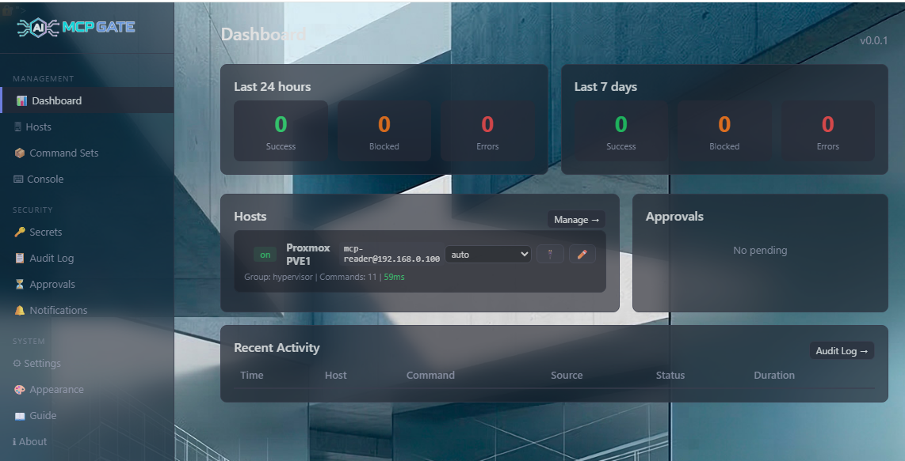
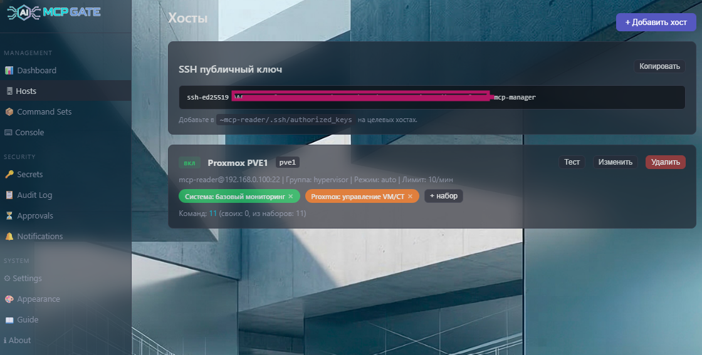
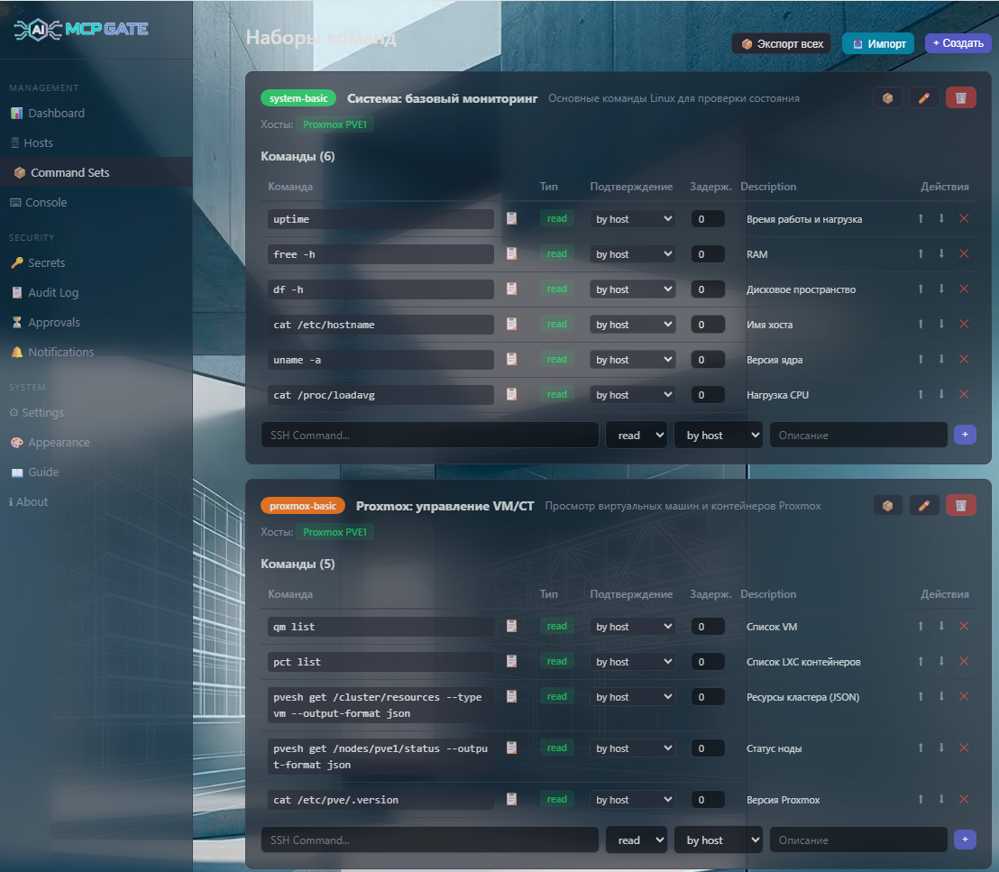
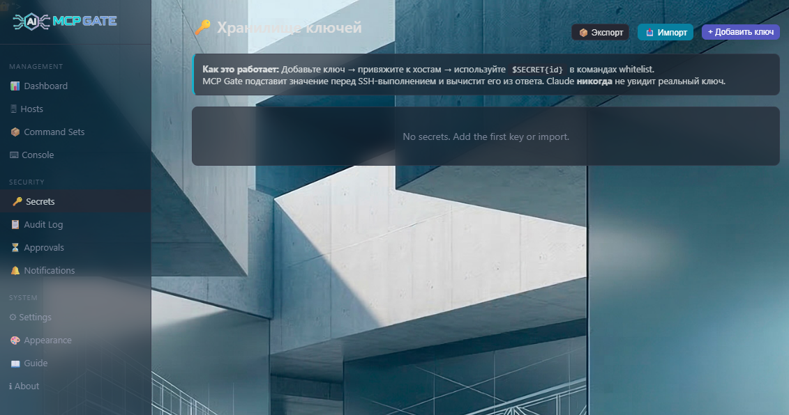
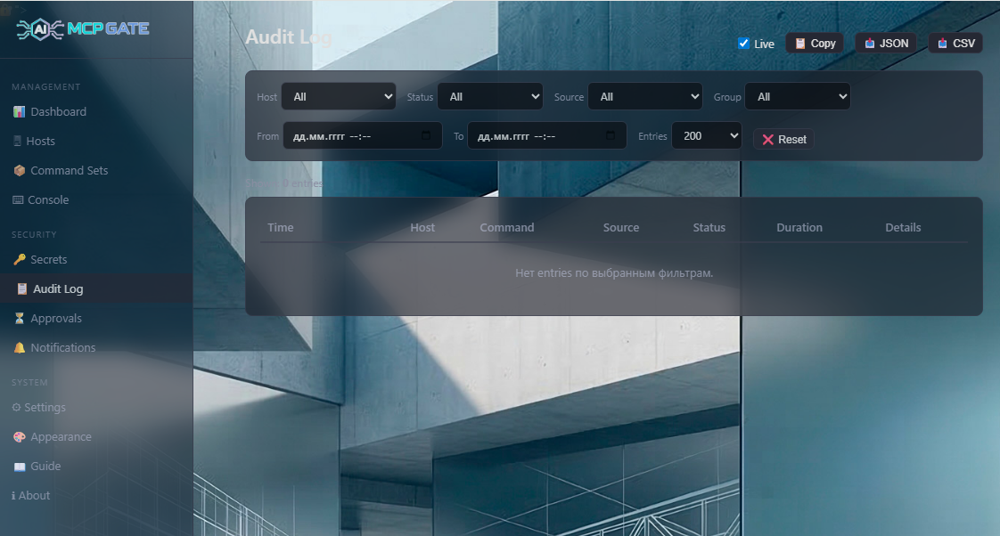
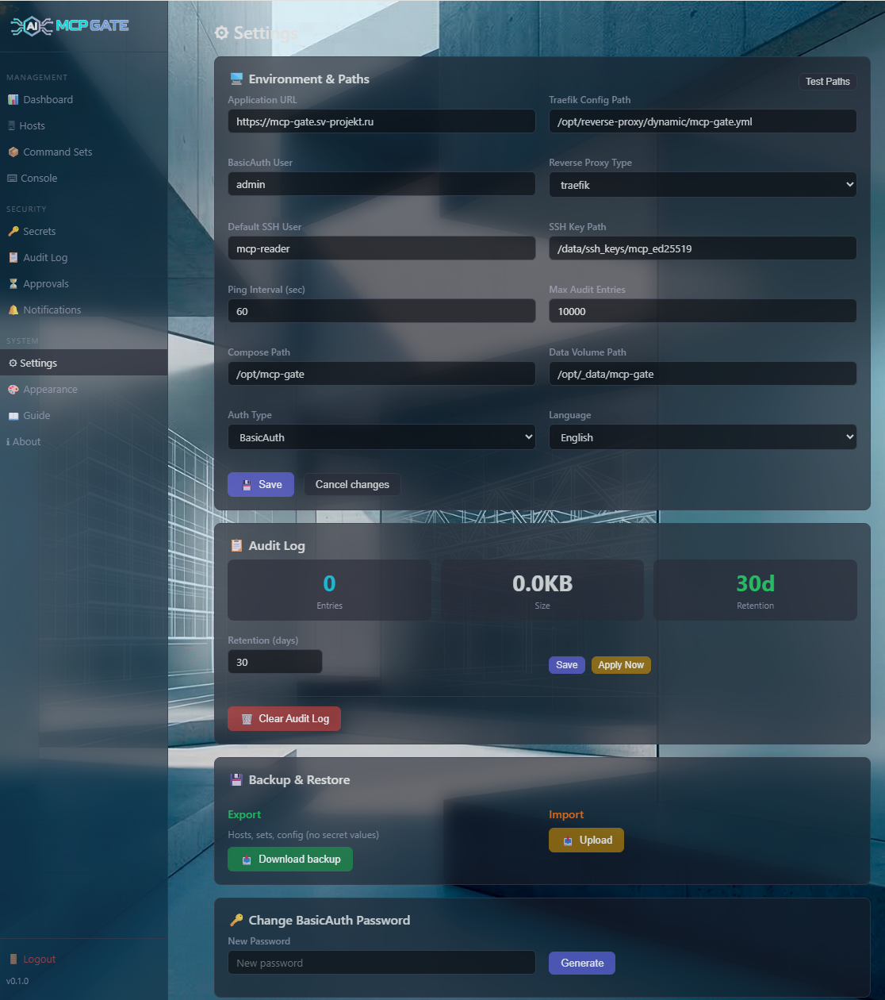
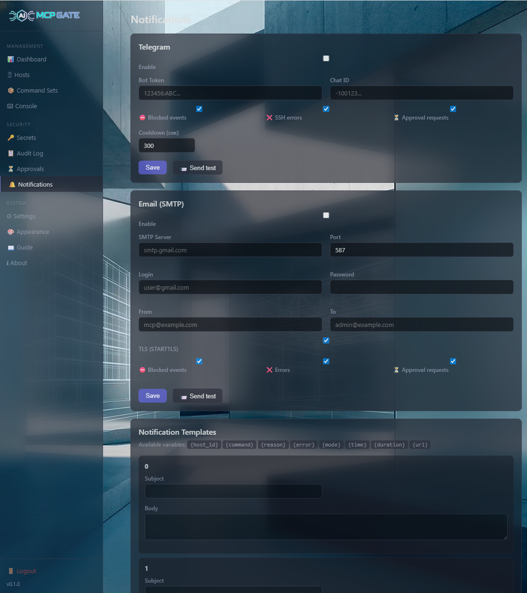

# MCP Gate

[](https://github.com/sv102/mcp-gate/releases)
[](https://www.gnu.org/licenses/agpl-3.0)
[](https://ghcr.io/sv102/mcp-gate)

**SSH Access Control for LLM Agents**

MCP Gate is a self-hosted web service that provides secure, controlled SSH access from LLM agents (Claude, GPT, etc.) to your infrastructure. Instead of giving AI assistants unrestricted shell access, MCP Gate enforces whitelists, approval workflows, rate limiting, and full audit logging.



## The Problem

LLM agents need to execute commands on your servers for monitoring, diagnostics, and automation. Direct SSH access is dangerous — one hallucinated `rm -rf` can destroy your infrastructure. MCP Gate sits between the agent and your servers, ensuring only approved commands run.

## How It Works

```
LLM Agent (Claude, GPT, ...)
        │
   MCP Connector / API call
        │
        ▼
   ┌─────────────┐
   │  MCP Gate    │  ← Whitelist check
   │              │  ← Rate limiting
   │  (this app)  │  ← Approval workflow
   │              │  ← Audit logging
   └──────┬──────┘
          │
     SSH (paramiko)
          │
          ▼
   Target Servers
   (only whitelisted commands)
```

## Features

| Feature | Description |
|---------|-------------|
| **Whitelist-only execution** | Only pre-approved commands can run. Everything else is blocked and logged |
| **Command Sets** | Reusable command groups with Allow/Deny types. Formula: `(host_allow ∩ agent_allow) - (host_deny ∪ agent_deny)` |
| **MCP Protocol** | Native Streamable HTTP + SSE transport. Claude.ai, Cursor, Windsurf, Continue, Cline connect via standard MCP connector |
| **OAuth 2.0** | Dynamic Client Registration, PKCE S256, per-agent Bearer tokens |
| **Authentication** | Three modes: `basic` (built-in login with bcrypt + signed session cookie), `proxy` (trust X-Forwarded-User from Authentik/Keycloak/etc.), `none` (homelab behind VPN) |
| **Agents** | Per-agent command sets, rate limits, allowed hosts. Supports Claude, ChatGPT, Gemini, Cursor, Windsurf, Continue, Cline, Open WebUI |
| **Parameterized commands** | Variables with regex validation: `docker logs {container} --tail {lines}` |
| **4 Approval Modes** | `auto`, `pessimistic`, `optimistic`, `strict` |
| **Secrets Vault** | Fernet-encrypted storage. `$SECRET{id}` substituted server-side, scrubbed from responses |
| **Audit Log** | Every request logged with context. CRUD events, approval decisions. Export as JSON/CSV. Live WebSocket updates |
| **Host Setup Instructions** | Auto-generated useradd, SSH authorized_keys, sudoers commands for each host |
| **Rate Limiting** | Per-host request limits to prevent LLM loops |
| **Notifications** | Telegram bot and SMTP email alerts |
| **Appearance Theming** | 6 built-in themes, glassmorphism, custom backgrounds |
| **Import/Export** | Paste JSON or drag-and-drop .json files. Backup and restore everything |
| **i18n** | English and Russian |

## Screenshots

| Dashboard | Hosts | Command Sets |
|-----------|-------|-------------|
|  |  |  |

| Secrets Vault | Audit Log | Settings |
|---------------|-----------|----------|
|  |  |  |

| Notifications |
|---------------|
|  |

## Quick Start

### Prerequisites

- Docker Engine 24+ with Compose V2 (`docker compose` command)
- SSH access to target servers

### 1. Clone and configure

```bash
git clone https://github.com/sv102/mcp-gate.git
cd mcp-gate
cp .env.example .env
```

Edit `.env`:
```bash
# Generate a secure token
MCP_TOKEN=$(openssl rand -hex 32)
echo "MCP_TOKEN=$MCP_TOKEN" > .env
echo "DATA_DIR=/data" >> .env

# If you plan to connect Claude.ai or other MCP clients, set your public URL:
echo "MCP_BASE_URL=https://mcp-gate.example.com" >> .env
```

### 2. Start

```bash
docker compose up -d
```

Or use the pre-built image (no build required):

```bash
# In compose.yaml, replace `build:` section with:
#   image: ghcr.io/sv102/mcp-gate:latest
docker compose up -d
```

### 3. Open the UI

Navigate to `http://your-server:8090`. On first launch you'll be prompted to:

1. **Set admin password** — creates your login credentials (bcrypt-hashed, stored locally)
2. **Bootstrap wizard** — generates SSH key pair and agent API key. **Save the API key immediately — it's shown only once.**

After setup, access the UI via the login page. Authentication mode can be changed in Settings (`basic`, `proxy`, or `none`).

### 4. Add a host

Go to **Hosts → Add Host**, fill in the hostname, SSH user, and assign command sets.

See [`docs/examples/`](docs/examples/) for sample host and command set configurations.

### 5. Deploy the SSH key

Each host page includes a **Host Setup Instructions** section with ready-to-copy commands for creating the SSH user, deploying the public key, and configuring sudoers.

### 6. Connect your LLM agent

**Claude.ai / Cursor / Windsurf / Continue / Cline** (MCP connector):

Add as MCP server in your client settings:
```
URL: https://your-server/mcp
```
The OAuth 2.0 flow handles authentication automatically.

**API (custom agents):**

```bash
curl -X POST https://your-server/api/exec \
  -H "X-API-Key: YOUR_KEY" \
  -H "Content-Type: application/json" \
  -d '{"host_id": "my-server", "command": "uptime"}'
```

## Architecture

```
┌──────────────────────────────────────┐
│            MCP Gate Container        │
│                                      │
│  FastAPI (Python 3.12)               │
│  ├── /api/exec       ← Agent API    │
│  ├── /api/hosts      ← Host list    │
│  ├── /mcp            ← MCP Protocol │
│  ├── /login          ← Auth UI      │
│  ├── /dashboard      ← Web UI       │
│  └── /ws/audit       ← Live events  │
│                                      │
│  Auth (basic/proxy/none)             │
│  MCP Transport (Streamable HTTP+SSE) │
│  OAuth 2.0 (DCR + PKCE S256)        │
│  Paramiko SSH client                 │
│  Fernet encryption (secrets)         │
│  YAML/JSONL persistence              │
└──────────────────────────────────────┘
```

### Data Files

All data is stored in human-readable YAML files (git-friendly, editable by hand):

| File | Purpose |
|------|---------|
| `data/config.yaml` | Main configuration (includes auth settings) |
| `data/hosts.yaml` | SSH host definitions |
| `data/command_sets.yaml` | Reusable command sets (Allow/Deny) |
| `data/agents.yaml` | Agent definitions and permissions |
| `data/secrets.yaml` | Fernet-encrypted secrets |
| `data/audit.jsonl` | Audit log (JSONL, append-only) |
| `data/ssh_keys/` | Generated SSH key pair + known_hosts |

## Configuration

### Environment Variables

| Variable | Default | Description |
|----------|---------|-------------|
| `MCP_TOKEN` | — | **Required.** API authentication token |
| `MCP_BASE_URL` | — | Public URL for MCP/OAuth (required for Claude.ai connector) |
| `DATA_DIR` | `/data` | Path to persistent data directory |

### Authentication Modes

Configured in Settings UI or `data/config.yaml` → `instance.auth_type`:

| Mode | Behavior |
|------|----------|
| `basic` | Built-in login page with bcrypt password and HMAC-signed session cookie (7-day expiry). Default. |
| `proxy` | Trust reverse proxy headers (`X-Forwarded-User`, `X-Forwarded-Email`). Use with Authentik, Keycloak, etc. |
| `none` | No authentication. For homelabs behind VPN where the network itself is the trust boundary. |

MCP transport and agent API endpoints use their own authentication (OAuth 2.0 / API keys) and are not affected by the UI auth mode.

### Reverse Proxy

MCP Gate works behind any reverse proxy. Example for Traefik:

```yaml
http:
  routers:
    mcp-gate:
      rule: "Host(`mcp-gate.example.com`)"
      service: mcp-gate
      tls:
        certResolver: le
  services:
    mcp-gate:
      loadBalancer:
        servers:
          - url: "http://mcp-gate:8000"
```

For production, consider adding IP allowlists and rate limiting at the proxy level. If using `proxy` auth mode, configure your identity provider (Authentik, Keycloak, etc.) to set `X-Forwarded-User` header.

### Approval Modes

| Mode | Behavior |
|------|----------|
| `auto` | Execute immediately |
| `pessimistic` | Wait for approval; timeout → reject |
| `optimistic` | Wait for approval; timeout → execute |
| `strict` | Wait forever until manually resolved |

### Custom Network

By default, MCP Gate creates its own Docker network. To join an existing network, create a `compose.override.yaml`:

```yaml
services:
  mcp-gate:
    networks:
      - your-network

networks:
  your-network:
    external: true
```

## Security

- **App-level authentication**: Built-in login (bcrypt + signed cookie), reverse proxy auth, or no auth — choose per deployment
- **Whitelist-only**: Commands not in the whitelist are blocked before SSH
- **Dual filtering**: `(host_allow ∩ agent_allow) - (host_deny ∪ agent_deny)` — deny always wins
- **Secrets never leak**: `$SECRET{id}` resolved server-side, scrubbed from responses and logs
- **Parameterized commands**: regex validation, shell character blocking
- **Full audit**: Every request, block, CRUD action, and approval decision logged
- **Managed known_hosts**: save-on-first-connect, reject-on-key-change (MITM protection)
- **Rate limiting**: Prevents LLM loops
- **Dedicated SSH key**: Ed25519, generated on first boot

## API Reference

### Execute Command
```
POST /api/exec
Headers: X-API-Key: YOUR_KEY
Body: {"host_id": "srv", "command": "uptime"}
→ {"status": "ok", "output": "...", "duration_ms": 230}
```

### Execute with Parameters
```
POST /api/exec
Body: {"host_id": "srv", "command": "docker logs {container} --tail {lines}", "args": {"container": "nginx", "lines": "50"}}
```

### List Hosts
```
GET /api/hosts → [{id, name, commands, command_sets}]
```

### Health
```
GET /health → {"status": "ok", "version": "0.0.7", "hosts_total": 2}
```

## Tech Stack

Python 3.12 · FastAPI · Paramiko · Fernet · bcrypt · Jinja2 + Alpine.js · YAML/JSONL · Docker

## Roadmap

- [ ] Multi-user RBAC
- [ ] HTTP Service Proxy (forward requests to internal services)
- [ ] Scheduled/cron commands
- [ ] Webhooks
- [ ] Official Docker Hub image

## Support the Project

If MCP Gate is useful to you, consider supporting its development:

**Cryptocurrency:**

| Currency | Address |
|----------|---------|
| Bitcoin (BTC) | `bc1qzg8fgty3306upse4fhl66ltfthyyf9r5guhlle` |
| Ethereum (ETH) | `0x6C68fD15B760b3c6a1F981b5e19e25A64b07F603` |
| Ethereum Classic (ETC) | `0x061aeA68810500A44bceD5b81Cd2dD3e4Ca0d782` |
| TON | `UQBPijPtuEAPUHrVKbTQKE4We8mOvX1ZMY7XSkruuWklMLN1` |

You can also ⭐ **star this repository** — it helps with visibility and costs nothing!

## License

[AGPLv3](LICENSE) — Free for self-hosted use. If you modify and offer it as a service, you must share the source.

## Author

**Sergey** — [@sv_102](https://t.me/sv_102) · [GitHub](https://github.com/sv102)

---

*MCP Gate — because your AI assistant shouldn't have root.*
